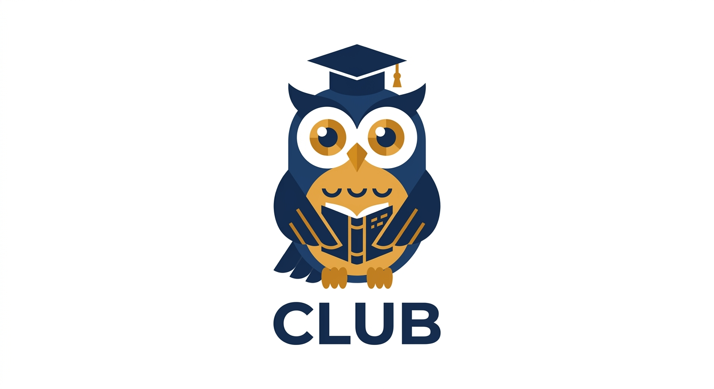

# CLUB — Come Learn Understand Buddy

> A local, privacy-first AI study assistant that reads your notes, summarizes them, generates quizzes, solves past-year questions, and builds personalized study plans — all running on your own machine.


-orange)

---

## Features

| Feature | What it does |
|---------|-------------|
| **Auto-Reader** | Drop PDFs, PPTX, DOCX, images, or textbooks → CLUB reads them automatically |
| **Summarizer** | Condenses study material into structured, exam-focused summaries |
| **Quizzer** | Generates MCQs, short-answer, and past-year-style questions |
| **Solver** | Solves questions step-by-step like a professor |
| **Planner** | Builds day-by-day study schedules based on your exam dates |
| **Daily Briefing** | Morning study briefing with focus topics and practice questions |
| **KnowMySchool** | Tailors everything to your university's exam pattern |
| **Vector Memory** | Remembers everything you've studied for context-aware answers |
| **Exam Feedback** | OCR your graded papers → identifies weak areas automatically |
| **Folder Watcher** | Monitors your study folders and indexes new files on the fly |

## 🏗️ Tech Stack

| Component           | Tool              |
|---------------------|-------------------|
| LLM                 | ollama (llama3)   |
| Agent Orchestration | LangGraph         |
| Vector Memory       | ChromaDB          |
| Chat UI             | Chainlit          |
| OCR                 | pytesseract       |
| Language            | Python 3.10+      |

**100% local. No API keys. No cloud. Your data stays on your machine.**

## 📁 Project Structure

```
club/
├── core/
│   ├── coordinator.py     # LangGraph router — the brain
│   ├── watcher.py         # Folder monitor + auto-indexer
│   └── memory.py          # ChromaDB vector store
├── agents/
│   ├── reader.py          # PDF/PPTX/DOCX/image/YouTube reader
│   ├── summarizer.py      # Structured summary generator
│   ├── quizzer.py         # MCQ/short-answer/PYQ generator
│   ├── solver.py          # Step-by-step question solver
│   └── planner.py         # Study schedule + daily briefing
├── knowmyschool/
│   ├── profile.py         # Student profile (config.yaml)
│   └── feedback.py        # Exam paper OCR + weak area analysis
├── interface/
│   └── app.py             # Chainlit chat UI
├── folder/
│   ├── notes/             # ← Drop lecture notes here
│   ├── pyqs/              # ← Drop past-year papers here
│   ├── images/            # ← Drop photos/scans here
│   ├── youtube/           # ← YouTube links (links.txt)
│   └── output/            # Generated briefings, plans
├── cli.py                 # Command-line interface
├── config.yaml            # Central configuration + profile
├── requirements.txt       # Python dependencies
└── README.md
```

## 🚀 Quick Start

### Prerequisites

- **Python 3.10+**
- **Ollama** — [Install from ollama.ai](https://ollama.ai)
- **Tesseract OCR** (optional, for image/handwritten notes)

### Installation

```bash
# 1. Clone and enter the project
git clone https://github.com/un1u3/club
cd club

# 2. Create a virtual environment
python3 -m venv venv
source venv/bin/activate

# 3. Install dependencies
pip install -r requirements.txt

# 4. Install and start Ollama with llama3
ollama pull llama3
ollama serve     # keep this running in another terminal

# 5. (Optional) Install Tesseract for OCR
sudo apt install tesseract-ocr    # Ubuntu/Debian
# brew install tesseract           # macOS

# 6. Initialize CLUB
python3 cli.py init

# 7. Launch!
python3 cli.py start
```

Then open **http://localhost:8000** in your browser.

### CLI Commands

```bash
python3 cli.py init       # Set up folders + student profile
python3 cli.py start      # Launch Chainlit chat UI
python3 cli.py briefing   # Generate today's study briefing
python3 cli.py index      # Index all files in folder/
python3 cli.py help       # Show all commands
```

##  How to Use

Once the UI is running, just type naturally:

| You type | CLUB does |
|----------|-----------|
| `Summarize binary search trees` | Generates a structured summary |
| `Quiz me on sorting algorithms` | Creates 5 MCQs with answers |
| `Give me past year questions on OS` | PYQ-style questions matching your exam |
| `Solve: explain BFS step by step` | Step-by-step solution like a professor |
| `Make me a study schedule` | Day-by-day plan based on your exams |
| `Give me today's briefing` | Morning focus, weak areas, practice Qs |

### Drop files to study

Just drop files into the `folder/` subdirectories:

- **`folder/notes/`** — Lecture PDFs, PPTX, DOCX, text files
- **`folder/pyqs/`** — Past-year question papers
- **`folder/images/`** — Photos of handwritten notes (OCR)

CLUB watches these folders and automatically reads + indexes new files.

##  Configuration

Edit `config.yaml` to customize:

```yaml
# Your student profile
profile:
  school: "Tribhuvan University"
  program: "BIT"
  semester: 3
  exam_style: "theory heavy, 3hr paper"
  exam_dates:
    DSA: "2026-04-15"
    OS: "2026-04-20"
  weak_areas:
    - recursion
    - graph traversal
```

## 🇳🇵 Language Support

CLUB works with **English and नेपाली** — type in either language and get responses accordingly.

## Troubleshooting

| Problem | Solution |
|---------|----------|
| "ollama is not running" | Run `ollama serve` in a separate terminal |
| "model not found" | Run `ollama pull llama3` |
| OCR fails | Install Tesseract: `sudo apt install tesseract-ocr` |
| Import errors | Make sure you're in the venv: `source venv/bin/activate` |
| ChromaDB errors | Delete `folder/.club_memory/` and re-index: `python3 cli.py index` |

## License

MIT — free for everyone, especially students who need it most.

---

*Built with ❤️ for students who learn better with AI.*